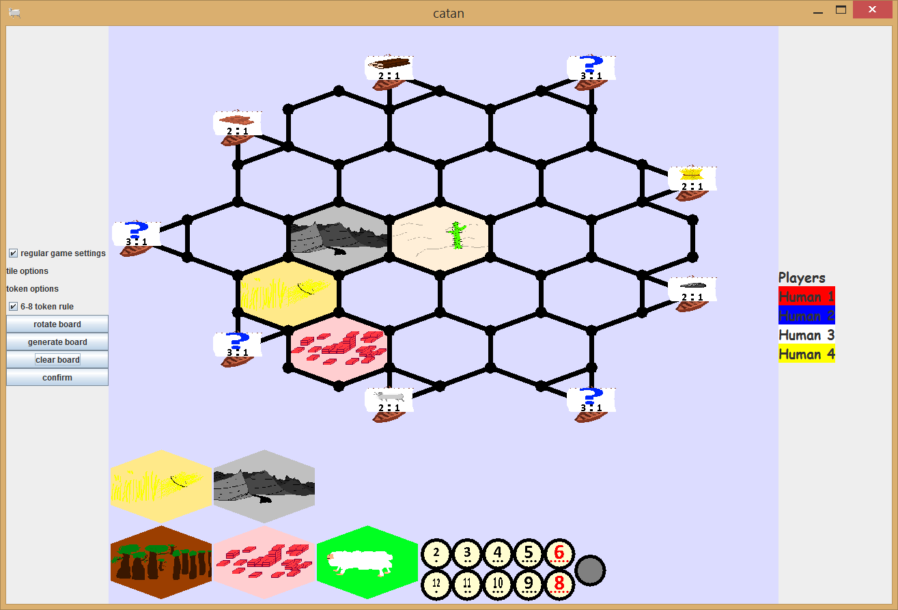

# Catan
The settlers of Catan boardgame, created by Klaus Teubar, implemented in Java. Currently a work in progress.

## Gameplay
Build settlements and expand to gain victory points! First player to 10 wins!

## Plan
Finish gameplay and GUI
allow for custom AIs to interface and play the game
design an observer mode which would allow games to be played over the network.